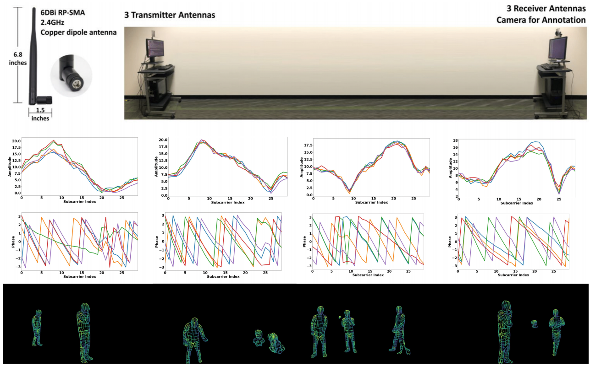

# DensePose_from_WiFi
Using of the WiFi signal in combination with deep learning architectures, commonly used in computer vision, to estimate dense human pose correspondence. 



> **VITON-HD: High-Resolution Virtual Try-On via Misalignment-Aware Normalization**<br>

> **Abstract:** *Advances in computer vision and machine learning techniques have led to significant development in 2D and 3D human pose estimation from RGB cameras, LiDAR, and radars. However, human pose estimation from images is adversely affected by occlusion and lighting, which are common in many scenarios of interest. Radar and LiDAR technologies, on the other hand, need specialized hardware that is expensive and power-intensive. Furthermore, placing these sensors in non-public areas raises significant privacy concerns.
To address these limitations, recent research has explored the use of WiFi antennas (1D sensors) for body segmentation and key-point body detection. This paper further expands on the use of the WiFi signal in combination with deep learning architectures, commonly used in computer vision, to estimate dense human pose correspondence. We developed a deep neural network that maps the phase and amplitude of WiFi signals to UV coordinates within 24 human regions. The results of the study reveal that our model can estimate the dense pose of multiple subjects, with comparable performance to image-based approaches, by utilizing WiFi signals as the only input. This paves the way for low-cost, broadly accessible, and privacy-preserving algorithms for human sensing.*

## Installation

Clone this repository:

```
git clone https://github.com/superstar1225/DensePose_from_WiFi.git
cd ./DensePose_from_WiFi/
```

Install PyTorch and other dependencies:

```
conda create -y -n [ENV] python=3.8
conda activate [ENV]
conda install -y pytorch=[>=1.6.0] torchvision cudatoolkit=[>=9.2] -c pytorch
```
